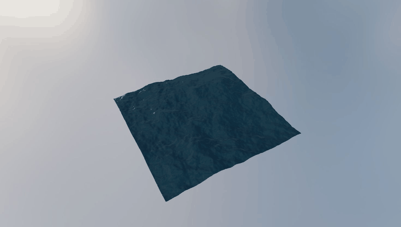

# FFT Ocean visual milestone

## Demo



The animation above is a five-second capture of the live WebGL simulation.

## Reports and reference

- [English report](report.pdf)
- [中文报告](report_cn.pdf)
- [Jerry Tessendorf, *Simulating Ocean Water* (2004 course notes)](tessendorf-ocean-course-notes-2004.pdf) — the original paper/course notes used as the main implementation reference.

A first runnable FFT-ocean study using:

- a seeded JONSWAP frequency spectrum converted to a directional 2D wavenumber spectrum;
- deep-water dispersion;
- `GPUComputationRenderer` evolving the Fourier spectrum every frame;
- packed GPU butterfly passes performing the 2D inverse FFT;
- paper-derived height, spectral slopes, and horizontal displacement;
- a `256 x 256` spectrum containing 65,536 frequency-domain modes;
- a `128 x 128 m` periodic physical FFT domain and matching rendered plane;
- `20 m/s` wind, `100 km` fetch, JONSWAP peak enhancement `6.0`, and `0.35 m` short-wave damping;
- frequency-dependent spreading, vertical display scale `1.0`, and choppiness disabled;
- no custom swell lobe or cross-wind energy floor;
- nearest-filtered FFT intermediates and linearly filtered final spatial fields;
- `three-custom-shader-material` extending `MeshStandardMaterial`;
- a dense `512 x 512` displaced plane;
- a single directional light over a solid atmospheric background.
- `citrus_orchard_puresky_1k.hdr` as a reflection/IBL environment without replacing the background.

The directional light is the only direct light. The HDRI supplies image-based lighting and reflections.

## Run

```bash
npm install
npm run dev
```

Open the URL printed by Vite. Drag to orbit and scroll to zoom.

## Current scope

After seeded JONSWAP-spectrum initialization, the simulation remains GPU-resident. `GPUComputationRenderer` evolves the spectrum over time. Packed render-target butterfly passes then inverse-transform height, Fourier slopes, and horizontal displacement. The next paper-derived field is the displacement Jacobian for folding and foam detection.
